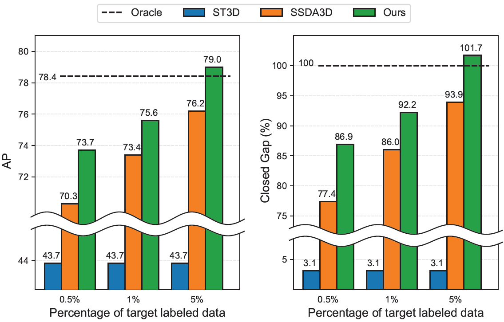

<div align='center'>

# Semi-Supervised Domain Adaptation Using Target-Oriented Domain Augmentation for 3D Object Detection

IEEE Transaction on Inteeligent Vehicles


[Yecheol Kim](https://rasd3.github.io)<sup>1*</sup>&nbsp;&nbsp;
Junho Lee<sup>1*</sup>&nbsp;&nbsp;
Changsoo Park<sup>2</sup> &nbsp;&nbsp;
Hyung won Kim<sup>2</sup>&nbsp;&nbsp;
Inho Lim<sup>2</sup>&nbsp;&nbsp;
Christopher Chang<sup>2</sup>&nbsp;&nbsp;
[Jun Won Choi](https://spa.snu.ac.kr/)<sup>3</sup>

<div>
<sup>1</sup> Hanyang University
<sup>2</sup> Kakao Mobility Corp
<sup>3</sup> Seoul National Univeristy
</div>
</div>

<br/>


This is official implementation of [Semi-Supervised Domain Adaptation Using Target-Oriented Domain Augmentation for 3D Object Detection](https://arxiv.org/abs/2406.11313). We prospose novel two-stage SSDA framework for 3D object detection TODA. TODA achieves SOTA on Waymo to nuScenes domain adaptation benchmarks, attains performances on par with the *Oracle* performance utilizing merely **5% of labeled data** in the target domain. 

<div align='center'>

</div>


**Abstract:** 3D object detection is crucial for applications like autonomous driving and robotics. However, in real-world environments, variations in sensor data distribution due to sensor upgrades, weather changes, and geographic differences can adversely affect detection performance. Semi-Supervised Domain Adaptation (SSDA) aims to mitigate these challenges by transferring knowledge from a source domain, abundant in labeled data, to a target domain where labels are scarce. This paper presents a new SSDA method referred to as Target-Oriented Domain Augmentation (TODA) specifically tailored for LiDAR-based 3D object detection. TODA efficiently utilizes all available data, including labeled data in the source domain, and both labeled data and unlabeled data in the target domain to enhance domain adaptation performance. TODA consists of two stages: TargetMix and AdvMix. TargetMix employs mixing augmentation accounting for LiDAR sensor characteristics to facilitate feature alignment between the source-domain and target-domain. AdvMix applies point-wise adversarial augmentation with mixing augmentation, which perturbs the unlabeled data to align the features within both labeled and unlabeled data in the target domain. Our experiments conducted on the challenging domain adaptation tasks demonstrate that TODA outperforms existing domain adaptation techniques designed for 3D object detection by significant margins.

## Citation
If you find this work or code useful, please cite 

```
@article{kim2024semi,
  title={Semi-Supervised Domain Adaptation Using Target-Oriented Domain Augmentation for 3D Object Detection},
  author={Kim, Yecheol and Lee, Junho and Park, Changsoo and won Kim, Hyoung and Lim, Inho and Chang, Christopher and Choi, Jun Won},
  journal={IEEE Transactions on Intelligent Vehicles},
  year={2024},
  publisher={IEEE}
}
```

